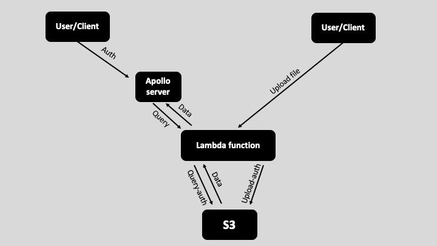

# Code Challenge Specification

### 1. Develop an API that enables external (unauthenticated) user to upload JSON files to S3 
<pre>
1.1 JSON file contains location data 
1.2 JSON file should contain : 
  - Latitude 
  - Longitude 
  - Additional data 
1.3 Name of the location is in the filename
</pre> 

### 2. Develop an API that enables (authenticated) users to extract data from uploaded JSON files
##### 2.1 Endpoint #1 - Listing all location names 
<pre>
   - Names should be extracted from the filename 
   - Private access
 </pre>
##### 2.2 Endpoint #2 - Details of specific location 
<pre>
  - Name 
  - Latitude 
  - Longitude 
  - Additional data 
  - Calculated bee-line distance from the  ( lat: 52.502931, lng: 13.408249) 
  - Private access 
</pre>
### 3. Testing
<pre>
3.1 Postman
</pre>
# AWS structure
<pre>

1. User/Client queries data trough GraphQL Apollo server. He needs to be authenticated in order 
to access the Lambda server endpoint. Endpoint itself is protected with an API key. 
2. User/Client uploads files directly to Lambda server and automaticly 
saves it to S3 bucket. No auth needed for User/Client.

</pre>

